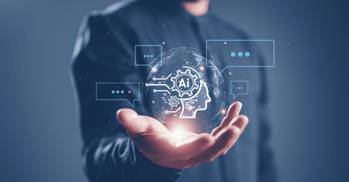

# GenAI - GENERATIVE AI

**Name:** Kinza Saeed (Senior student)  
**Roll Number:** 00160400  
**Field:** AI

> *“When we think about the future of the internet, I would guess that 90% of content will no longer be generated by humans. It will be generated by bots,”*  
> — Latanya Sweeney, Professor of the Practice of Government and Technology at the Harvard Kennedy School and in the Harvard Faculty of Arts and Sciences.

## What is Generative AI?
Generative AI is a type of artificial intelligence that creates new content like text, images, music, audio, and videos, based on user prompts or existing data. It learns patterns from massive datasets and uses them to generate novel outputs, rather than just locating and curating existing information like search engines.

Generative AI is all over the world. In fact, some of those headlines may actually have been written by generative AI, like OpenAI’s ChatGPT, a chatbot that has demonstrated an uncanny ability to produce text that seems to have been written by a human.

## How It Works
1. You give input (like asking a question or giving a prompt)
2. AI breaks your input into smaller parts (like words or pieces of words)
3. AI turns those parts into numbers so it can understand them
4. The AI "thinks" using a big brain (neural network) trained on lots of data
5. It decides what to say, draw, or create next
6. AI turns its answer from numbers back into words or images
7. You get the final result (like a sentence, picture, or code)

## Benefits of Generative AI
- **Healthcare**: Creates medical images, helps discover new drugs.
- **Education**: AI tutors, quiz generators, lesson planning.
- **E-commerce**: Writes product descriptions, supports customers.
- **Media**: Generates art, music, videos, game content.
- **Business**: Writes emails, reports, presentations.
- **Programming**: Auto-writes code, fixes bugs, adds comments.

## Cons of Generative AI
- **Bias**: Can reflect unfair or harmful views from training data.
- **Misinformation**: May generate fake or incorrect content.
- **Job Impact**: Might replace some human roles.
- **Privacy Risk**: Can use or leak sensitive data.
- **Lack of Control**: Sometimes gives unexpected or unclear results.
- **Overuse**: Can reduce creativity or human effort.

## Final Conclusion
Generative AI is a powerful tool that boosts creativity, saves time, and improves productivity across many industries like healthcare, education, business, and entertainment. However, it also comes with risks like bias, misinformation, and privacy concerns.

---

Thank you...
